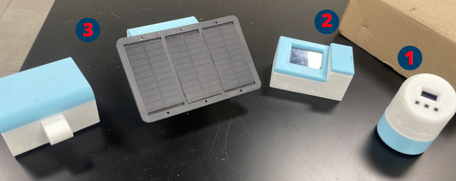

<h1 align="center">
  Hola👋, Mi nombre es Jesús Cervantes.
</h1>

Soy ingeniero en mecatrónica, gradudado por el Tecnológico de Monterrey, con una especialización en sistemas ciber-físicos. Entusiasta en el trabajo en equipo desarrollando proyectos mecatrónicos que contribuyan al desarrollo de la sociedad. Soy muy apasionado en el área de la programación (Matlab, C++, Python, java), el diseño asistido por computadora CAD y sobre todo de trabajar en el diseño electrónico, especialmente en el área de semiconductores. Creo fielmente que la industria de semiconductores ha sido la responsable del mayor desarrollo tecnológico que hemos experimentado y me gustaría contribuir en esta grandiosa área de conocimiento. Persona responsable, con gran interés en el autoaprendizaje, comprometida, creativa y en búsqueda constante de nuevos retos profesionales y académicos.

<h3>Conecta conmigo en LinkedIn</h3>

<h3>Languages and tools</h3>

  

    
  

  

    
  

  

    
  

<h2>Proyectos</h2>
<h3>Red de sensores meteorológicos</h3>

  La contaminación ambiental en la zona metropolitana de Guadalajara ha repercutido en el aumento de enfermedades respiratorias en la población. Para la mitigación de este tipo de problemas, es indispensable realizar un monitoreo constante de concentraciones de partículas con un diámetro igual o menor a 2.5 μm. En este proyecto se desarrolló el diseño e implementación de 3 distintos dispositivos que permitieran medir ciertas condiciones meteorológicas, con el objetivo de conocer la calidad del aire en cierta área de una metrópolis.

  

  Descripción de cada uno de los dispositivos.
  <ul>
    <li>Dispositivo 1 (Home edition)</li>
    <li>Dispositivo 2 (At Home +)</li>
    <li>Dispositivo 3 (AW - 1)</li>
  </ul>

<h3>Robot móvil autónomo</h3>

  E

<!--
**JesusC26/JesusC26** is a ✨ _special_ ✨ repository because its `README.md` (this file) appears on your GitHub profile.

Here are some ideas to get you started:

- 🔭 I’m currently working on ...
- 🌱 I’m currently learning ...
- 👯 I’m looking to collaborate on ...
- 🤔 I’m looking for help with ...
- 💬 Ask me about ...
- 📫 How to reach me: ...
- 😄 Pronouns: ...
- ⚡ Fun fact: ...
-->
