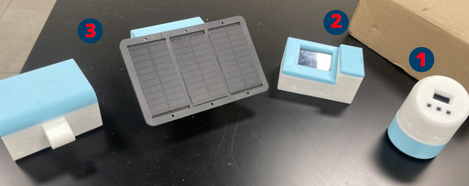
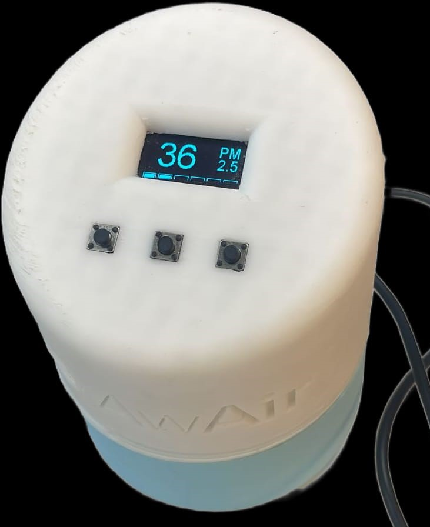
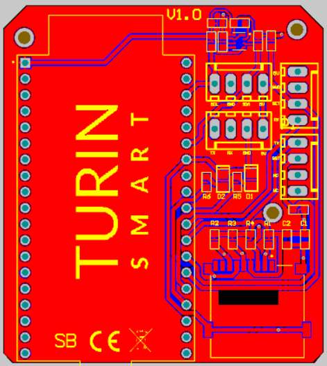
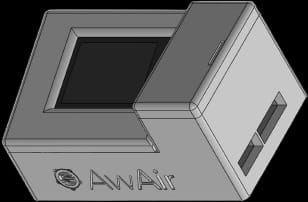
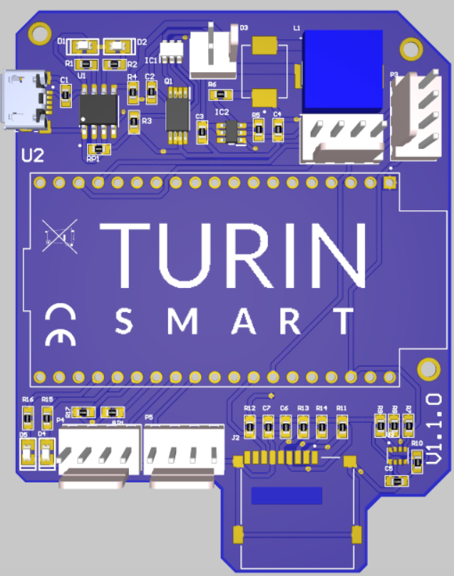
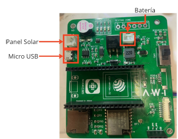

<h1 align="center">
  Hola👋, Mi nombre es Jesús Cervantes.
</h1>

Soy ingeniero en mecatrónica, gradudado por el Tecnológico de Monterrey, con una especialización en sistemas ciber-físicos. Entusiasta en el trabajo en equipo desarrollando proyectos mecatrónicos que contribuyan al desarrollo de la sociedad. Soy muy apasionado en el área de la programación (Matlab, C++, Python, java), el diseño asistido por computadora CAD y sobre todo de trabajar en el diseño electrónico, especialmente en el área de semiconductores. Creo fielmente que la industria de semiconductores ha sido la responsable del mayor desarrollo tecnológico que hemos experimentado y me gustaría contribuir en esta grandiosa área de conocimiento. Persona responsable, con gran interés en el autoaprendizaje, comprometida, creativa y en búsqueda constante de nuevos retos profesionales y académicos.

<h3>Conecta conmigo en LinkedIn</h3>

<h3>Languages and tools</h3>

  
  
  
  
  
  

<h2>Proyectos</h2>
<h3>Red de sensores meteorológicos</h3>

  La contaminación ambiental en la zona metropolitana de Guadalajara ha repercutido en el aumento de enfermedades respiratorias en la población. Para la mitigación de este tipo de problemas, es indispensable realizar un monitoreo constante de concentraciones de partículas con un diámetro igual o menor a 2.5 μm. En este proyecto se desarrolló el diseño e implementación de 3 distintos dispositivos que permitieran medir ciertas condiciones meteorológicas, con el objetivo de conocer la calidad del aire en cierta área de una metrópolis.

  

  Descripción de cada uno de los dispositivos.
  <ul>
    <li>Dispositivo 1 (Home edition):</li>
      

      Esta versión se caracteriza como el dispositivo con menor complejidad de uso para el usuario. El modelo integro una PCB, la cual mantiene la integración dentro de la PCB el sensor BMP280 (Sensor que nos ayuda a medir presión atmosférica), además se implementó una memoria microSD (con el objetivo de guardar un back-up de los datos), se agregaron borneras para conectar los demás sensores utilizados (PMS5003 y DHT22, los cuales nos ayudan a medir partículas finas y temperatura respectivamente). Cabe mencionar que se utilizaron componentes SMD que nos ayudaron a reducir el tamaño de nuestra PCB. Los datos que recolecta el sistema son publicados directamente en Firebsase Realtime Database, que a su vez son transferidos a una interfaz gráfica para su visualización en cualquier parte del mundo.
      

      

        
        
      

    <li>Dispositivo 2 (At Home +):</li>
      

      Nuestra segunda versión permite ser un dispositivo que pueda ser llevado a cualquier lugar, ya que este integra una batería recargable, y además una pantalla touch para que pueda ser más amigable con el usuario. Con respecto a la parte electrónica, se añadieron integrados distintos (DW01-A y 8205A, nos ayudan a realizar la carga de la batería) los cuáles se implementaron en una configuración de tipo TP4056, la cual nos permite cargar la batería de manera segura, de acuerdo con las distintas fases de carga para estas.
      

      

        
        
      

    <li>Dispositivo 3 (AW - 1):</li>
      

      Finalmente, nuestro modelo más complejo de todos, el cual contempla las características mencionadas anteriormente, solo con diferenciación en el área de carga de la batería, ya que este modelo cuenta con la conexión de un pequeño panel solar que le da autonomía de energía al dispositivo. Pero, su mayor característica en este modelo es que dicho dispositivo tiene la capacidad para interconectarse con otro dispositivo, mediante un protocolo de comunicación de radiofrecuencia llamado LoRa. Estos dispositivos se comunican entre sí, para formar una malla y poder transmitir información recolectada por cada nodo hacia un Gateway, el cual se encarga de subir toda la información (de toda la malla) a la nube y pueda ser visualizada por cualquier persona en un Dashboard. El objetivo principal de esta característica es poder mapear la calidad de aire en un área extensa, como por ejemplo en una ciudad.
      

      

        
      

  </ul>
  <a href="https://drive.google.com/drive/folders/1eiuvkdpiHxJToPeLuIFRoA54uQjY4gR3?usp=sharing"> Para mayor información del proyecto haga click aquí</a>

<h3>Robot móvil autónomo, usando SLAM</h3>

  Description of the project!

<!--
**JesusC26/JesusC26** is a ✨ _special_ ✨ repository because its `README.md` (this file) appears on your GitHub profile.

Here are some ideas to get you started:

- 🔭 I’m currently working on ...
- 🌱 I’m currently learning ...
- 👯 I’m looking to collaborate on ...
- 🤔 I’m looking for help with ...
- 💬 Ask me about ...
- 📫 How to reach me: ...
- 😄 Pronouns: ...
- ⚡ Fun fact: ...
-->
